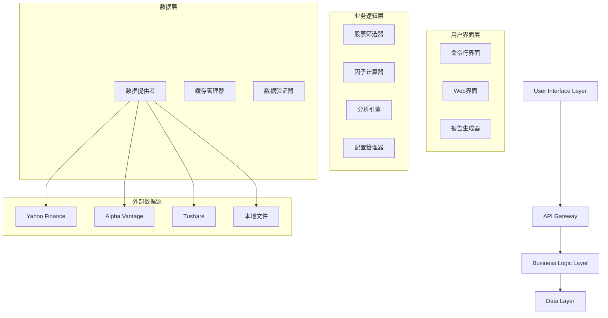

# 设计文档: 量化选股系统

## 概述

量化选股系统是一个综合性的金融分析工具，使投资者能够使用可配置的基于因子的方法论在多个全球市场中筛选和分析股票。系统优先使用在线数据源进行实时分析，同时通过智能缓存机制提供强大的离线功能。

系统架构遵循模块化设计模式，在数据获取、因子计算、筛选逻辑和展示层之间实现清晰的关注点分离。这种设计使得系统能够轻松扩展新市场、因子和分析方法，同时保持高性能和可靠性。

## 架构

系统遵循分层架构，包含以下主要组件：



## 组件和接口

### 数据提供者组件

数据提供者作为所有数据获取操作的中央枢纽，实现基于优先级的数据源选择机制。

**接口:**
```python
class DataProvider:
    def get_stock_data(self, symbols: List[str], market: str) -> DataFrame
    def get_financial_data(self, symbol: str, period: str) -> Dict
    def validate_connection(self, source: str) -> bool
    def set_source_priority(self, sources: List[str]) -> None
```

**主要特性:**
- 数据源之间的自动故障转移
- 基于TTL过期的智能缓存
- 速率限制和重试机制
- 多市场支持与格式标准化

### 因子计算器组件

因子计算器实现所有财务因子计算逻辑，支持自定义权重方案。

**接口:**
```python
class FactorCalculator:
    def calculate_pe_ranking(self, stocks: DataFrame) -> Series
    def calculate_pb_ps_ranking(self, stocks: DataFrame) -> Series
    def calculate_revenue_growth_ranking(self, stocks: DataFrame) -> Series
    def calculate_composite_score(self, factors: Dict[str, Series], weights: Dict[str, float]) -> Series
    def normalize_scores(self, scores: Series, method: str) -> Series
```

**支持的因子:**
- 带负值处理的PE比率
- PB * PS复合因子
- 营收增长（年同比和季度加权）
- 销售费用比率
- 资产负债率偏差

### 股票筛选器组件

股票筛选器通过协调数据获取、因子计算和排名来编排筛选过程。

**接口:**
```python
class StockScreener:
    def screen_stocks(self, pool: StockPool, config: ScreeningConfig) -> DataFrame
    def apply_filters(self, stocks: DataFrame, filters: List[Filter]) -> DataFrame
    def rank_stocks(self, stocks: DataFrame, factors: Dict[str, float]) -> DataFrame
```

### 分析引擎组件

分析引擎提供深度财务分析功能，包括核心利润计算和估值分析。

**接口:**
```python
class AnalysisEngine:
    def calculate_core_profit(self, financial_data: Dict) -> float
    def calculate_core_pe(self, market_cap: float, core_profit: float) -> float
    def generate_analysis_report(self, symbol: str) -> AnalysisReport
    def compare_valuations(self, core_pe: float, market_pe: float) -> ValuationComparison
```

## 数据模型

### 股票数据模型
```python
@dataclass
class Stock:
    symbol: str
    name: str
    market: str
    currency: str
    market_cap: float
    pe_ratio: Optional[float]
    pb_ratio: Optional[float]
    ps_ratio: Optional[float]
    revenue_growth: Optional[float]
    debt_to_asset: Optional[float]

class StockPool:
    name: str
    market: str
    symbols: List[str]
    last_updated: datetime
```

### 配置模型
```python
@dataclass
class ScreeningConfig:
    name: str
    factor_weights: Dict[str, float]
    filters: List[Filter]
    market_settings: Dict[str, Any]

@dataclass
class Filter:
    field: str
    operator: str
    value: Union[float, str]
    enabled: bool
```

### 分析结果模型
```python
@dataclass
class ScreeningResult:
    stocks: List[Stock]
    composite_scores: Dict[str, float]
    factor_scores: Dict[str, Dict[str, float]]
    metadata: Dict[str, Any]

@dataclass
class AnalysisReport:
    symbol: str
    core_profit: float
    core_pe: float
    market_pe: float
    valuation_analysis: str
    recommendations: List[str]
```

## 正确性属性

*属性是在系统的所有有效执行中都应该保持为真的特征或行为——本质上是关于系统应该做什么的正式声明。属性作为人类可读规范和机器可验证正确性保证之间的桥梁。*

### 属性 1: 数据源故障转移
*对于任何*数据请求，当主数据源失败时，系统应该自动尝试优先级列表中的下一个可用源，无需用户干预。
**验证: 需求 1.2, 1.5**

### 属性 2: 因子评分一致性
*对于任何*股票集合和因子权重，当使用相同的输入数据时，重新计算综合评分应该产生相同的结果。
**验证: 需求 4.1, 4.2**

### 属性 3: 股票代码格式识别
*对于任何*来自支持市场的有效股票代码（中国：XXXXXX.SZ/SH，香港：XXXX.HK，美国：XXXX，新加坡：XXX.SI），系统应该正确识别市场并处理股票。
**验证: 需求 2.8**

### 属性 4: PE比率排名一致性
*对于任何*具有PE比率的股票列表，负PE比率的股票应该总是排名低于（更差）正PE比率的股票，在每组内，排名应该按升序排列。
**验证: 需求 3.1**

### 属性 5: 缓存性能优化
*对于任何*频繁访问的数据，在缓存TTL期间内的后续请求应该从缓存提供服务，而不进行外部API调用。
**验证: 需求 1.4, 9.4**

### 属性 6: 配置持久化
*对于任何*有效的配置更改，保存然后加载配置应该将所有设置恢复到之前的确切状态。
**验证: 需求 6.1, 6.2**

### 属性 7: 缺失数据处理
*对于任何*具有不完整因子数据的股票，综合评分计算应该仅使用可用因子，不应失败或产生无效结果。
**验证: 需求 4.4, 5.3**

### 属性 8: 货币转换一致性
*对于任何*涉及货币转换的跨市场分析，从货币A转换到B然后再转换回A应该在可接受的舍入容差内产生原始值。
**验证: 需求 2.10**

### 属性 9: 数据验证完整性
*对于任何*缺少关键字段的数据集，数据验证器应该识别并标记所有缺失字段，不产生假阴性。
**验证: 需求 8.1**

### 属性 10: 导出数据完整性
*对于任何*导出为CSV或Excel格式的筛选结果，导入导出的数据应该完全重现原始数据集。
**验证: 需求 7.1, 7.3**

### 属性 11: 并行处理正确性
*对于任何*独立因子计算集合，并行处理应该产生与顺序处理相同的结果。
**验证: 需求 9.3**

### 属性 12: 在线数据优先级
*对于任何*网络连接可用时的数据请求，系统应该在回退到缓存数据之前尝试在线源。
**验证: 需求 11.3**

## 错误处理

系统在所有层实现全面的错误处理：

### 数据层错误
- **网络故障**: 自动故障转移到替代数据源
- **API速率限制**: 带抖动的指数退避重试尝试
- **数据格式错误**: 优雅降级与部分数据处理
- **认证失败**: 清晰的错误消息与修复步骤

### 业务逻辑错误
- **无效股票代码**: 市场特定格式检查验证
- **缺失财务数据**: 带清晰指示器的部分计算
- **配置错误**: 带建议修复的详细验证消息
- **计算溢出**: 带边界检查的安全算术

### 用户界面错误
- **文件导入错误**: 逐行验证与错误报告
- **导出失败**: 带替代格式的重试机制
- **配置加载**: 备份配置恢复
- **进度报告**: 中断操作的优雅处理

## 测试策略

系统采用双重测试方法，结合单元测试进行特定功能测试和基于属性的测试进行全面验证。

### 单元测试重点
- 特定市场指数支持验证
- 默认配置验证
- 报告生成格式检查
- 性能基准验证
- 用户界面组件测试

### 基于属性的测试配置
- **测试框架**: Python的Hypothesis
- **测试迭代**: 每个属性测试最少100次迭代
- **数据生成**: 财务数据、股票代码和市场场景的自定义生成器
- **属性测试标签**: 每个测试标记格式为"Feature: quantitative-stock-screening, Property X: [属性描述]"

### 集成测试
- 端到端筛选工作流
- 多市场数据集成
- 重启后配置持久化
- 真实数据报告生成
- 大数据集性能测试

### 测试数据管理
- 合成财务数据生成器
- 各种场景的模拟API响应
- 回归测试的历史数据快照
- 边界测试的边缘案例数据集